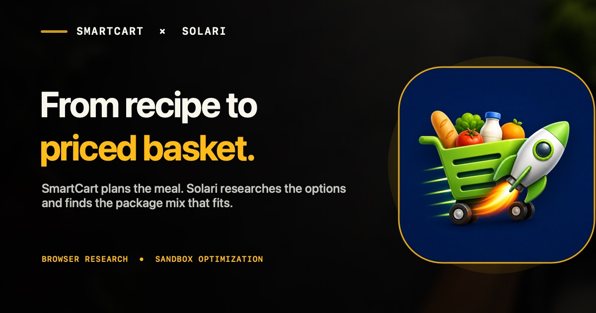

# SmartCart × Solari

**[Try the live research flow](https://exo-robotics.github.io/smartcart-solari/)** · **[Watch SmartCart before and after Solari](https://exo-robotics.github.io/smartcart-solari/#native-flow)** · **[See the verified run](https://exo-robotics.github.io/smartcart-solari/verified-run.html)** · [Inspect the receipt](evidence/live/smartcart-solari-v4-qualification-33546912947.json)

SmartCart could already turn a recipe into a shopping list. The annoying part came next: figuring out which packages to actually buy.

I used Solari to close that gap. Solari Browser researches approved product pages, Solari Sandbox compares the complete basket, and SmartCart checks the result before showing it to the shopper.

The shopper still makes the final decision.

## The problem before Solari

SmartCart already knew how to:

- turn recipes into ingredients
- remove items the shopper already has
- combine quantities across a meal
- prepare a shopping list
- hand the shopper off to a retailer

But that handoff still left real work to do. A recipe might need 1.5 lb of chicken, 12 oz of pasta, and 3 oz of Parmesan, while the store sells different package sizes at different prices. The shopper had to search each item, compare packages, and work out how much food they would actually be buying.

## What Solari changed

SmartCart now offers an optional **Research current options** step before the normal retailer handoff.

- **Solari Browser** opens approved rendered product pages and records the product, package size, visible price, source, and observation time.
- **Solari Sandbox** considers those observations together and chooses a complete basket under SmartCart's cost and overbuying rules.
- **SmartCart** verifies the evidence and arithmetic, then explains the recommendation in its native interface.
- **The shopper** can accept the research, edit the list, refresh it, or continue with the original SmartCart flow.

SmartCart still owns the recipe, pantry, quantities, user experience, and final action. Solari adds the research and decision layer that was missing.

## A real decision, not just a price scrape

In the qualified eight-item run, the cheapest basket that covered the recipe cost **$23.57**. SmartCart × Solari selected a **$24.20** basket instead.

Why spend another **$0.63**?

The cheaper basket used a 3 lb bag of chicken. The selected basket used a 1.5 lb package that still covered the recipe, avoiding roughly **680 g / 1.5 lb of excess chicken** while staying inside the shopper's $0.75 premium limit.

That is the useful part of the integration. Browser finds what the packages actually say; Sandbox can compare the effect of those package choices across the whole trip. The answer is not always the cheapest individual product.

## How it works

~~~text
Recipe + pantry
      |
      v
SmartCart shopping requirements
      |
      v
Solari Browser observes approved product pages
      |
      v
Solari Sandbox compares complete baskets
      |
      v
SmartCart verifies and explains the result
      |
      v
Shopper chooses what happens next
~~~

If SmartCart cannot safely research an item, that item stays on the original shopping list with a clear reason. If Solari is unavailable, normal SmartCart still works.

## Try it

The fastest path is the **[public case study](https://exo-robotics.github.io/smartcart-solari/)**. Press **Research this meal** to request the fixed eight-item Demo Grocer run. A fresh request may execute Solari Browser and Sandbox and provide a short-lived Browser replay. Rate-limited visitors receive the last verified result, clearly labeled as cached rather than live.

You can also:

- switch between the [before and after recordings](https://exo-robotics.github.io/smartcart-solari/#native-flow);
- read the [human-friendly verified result](https://exo-robotics.github.io/smartcart-solari/verified-run.html);
- inspect the [credentialed GitHub Actions run](https://github.com/EXO-Robotics/smartcart-solari/actions/runs/33546912947); or
- run the small [Solari Cookbook example](https://github.com/EXO-Robotics/solari-cookbook/tree/main/examples/smartcart-basket-research-ts).

The native recordings are labeled **DEBUG RECORDED REPLAY · NOT LIVE**. They show the iPhone experience; the receipts above prove the separate credentialed provider runs.

## Why Browser and Sandbox?

### Browser gathers the evidence

Product pages are rendered web interfaces, not stable rows in SmartCart's database. Browser gives the backend a controlled way to observe the package identity, quantity, visible synthetic price, source, and time from an approved page. The qualified catalog intentionally puts price data in rendered JavaScript so a static page download is not enough.

### Sandbox makes the basket decision

Choosing a package on each line independently can create a cheap but wasteful basket. Sandbox evaluates the allowed combinations across the trip, finds the cheapest adequate reference, and then looks for less overbuying within the shopper's small premium limit. SmartCart verifies coverage, prices, evidence membership, and policy limits before it displays the result.

### Why no Desktop?

Desktop is intentionally absent because Browser and Sandbox already perform the two jobs this workflow needs; adding another surface would not improve the shopper's result.

## Trust boundaries

- The qualified catalog is **SmartCart's owned synthetic Demo Grocer**, not a commercial retailer. No current Walmart, Target, or other commercial-retailer pricing is claimed.
- Historical Walmart data in the repository is fixture replay only.
- Solari never receives a retailer login and never changes a cart, places an order, submits payment, or checks out.
- Solari and backend credentials remain server-side; no permanent provider or operator secret ships in the app or web page.
- SmartCart rejects missing, stale, mismatched, or incomplete evidence instead of inventing a price.
- The shopper controls the final retailer handoff.

The public route is fixed to one owned meal and one allowlisted catalog. It has quotas, cancellation, cleanup, and a server-side kill switch. The app's protected beta routes remain separate from that public demonstration.

## Proof

| Check | Result |
| --- | --- |
| Frozen V4 provider qualification | **PASS** — real Solari Browser + Sandbox run [33546912947](https://github.com/EXO-Robotics/smartcart-solari/actions/runs/33546912947) |
| Qualified trip | **PASS** — 8 requirements, 16 Browser observations, 8 Sandbox decisions, confirmed cleanup |
| Basket decision | **PASS** — $24.20 selected vs. $23.57 cheapest adequate; +$0.63 avoided about 1.5 lb excess chicken |
| Self-serve public route | **PASS** — credentialed 17.596-second run, 16 observations, 8 decisions, 0 skipped lines, confirmed cleanup ([receipt](evidence/live/smartcart-solari-public-demo-20260902.json)) |
| Focused tests | **PASS** — backend 100/100, full backend 230/230, native 29/29, case study 6/6, catalog/replay 7/7 |
| Native beta build | **PASS** — unsigned `Release-SolariBeta` Simulator build |
| Signed App Attest device run | **PENDING** |
| TestFlight / App Store / downloadable app | **PENDING** |
| Authorized commercial-retailer research | **PENDING** |
| Independent household usage | **PENDING** |

The provider receipt proves server-side Solari execution. It does not prove a signed iPhone request, commercial-retailer coverage, TestFlight distribution, or product-market fit. Those are separate milestones.

## Architecture and detailed evidence

The implementation uses versioned request, observation, decision, and result contracts shared by the backend and native client. Deep implementation and qualification details live outside this README:

- [Experiment and responsibility split](Docs/SOLARI_EXPERIMENT.md)
- [Qualification matrix](Docs/SOLARI_QUALIFICATION.md)
- [Threat model](Docs/SOLARI_THREAT_MODEL.md)
- [Demo and provider runbook](Docs/SOLARI_DEMO_RUNBOOK.md)
- [Development-only App Attest lane](Docs/SOLARI_DEVELOPMENT_LANE.md)
- [Submission evidence packet](Docs/SOLARI_SUBMISSION_PACKET.md)
- [V4 contracts](contracts/v4/solari/)

The frozen provider-qualified runtime is commit [`2dd4e6f`](https://github.com/EXO-Robotics/smartcart-solari/commit/2dd4e6f30be8286a3a8f465c92a56427828a60e2). Its [sanitized receipt](evidence/live/smartcart-solari-v4-qualification-33546912947.json) binds the request and result to that exact run. Later commits add the public route, presentation, and documentation without rewriting the frozen receipt.

## Run it locally

Requirements: Xcode, Node.js, npm, and Python 3. Solari credentials are only needed for an authorized provider run and belong on the backend.

~~~bash
git clone https://github.com/EXO-Robotics/smartcart-solari.git
cd smartcart-solari
npm --prefix backend ci
npm --prefix backend run test:solari
npm --prefix backend test
python3 website/solari-demo/validate.py
~~~

For the native recorded-replay path, open `SmartCart.xcodeproj`, choose the `SmartCart` scheme and an iPhone Simulator, then run Debug. From Home, tap **Open Solari Demo Meal**, continue through **Recipe Review**, and tap **Research current options**.

For deployment or a real provider qualification, use the [runbook](Docs/SOLARI_DEMO_RUNBOOK.md). A passing health check is not provider proof, and a Simulator build is not device or App Store proof.

## Built from SmartCart

SmartCart is an existing grocery-planning application built by **Blake Grove / [@AionForge](https://x.com/AionForge)**. This public submission is maintained under EXO-Robotics and was forked from SmartCart commit [`fe6589b`](https://github.com/EXO-Robotics/smartcart-ios/commit/fe6589b1bd811a7ca8afa9824deba9d3cbde7ab9).

The Solari fork adds an optional research step immediately before SmartCart's existing retailer handoff. It does not replace the recipe, pantry, list, retailer, cart, or checkout behavior in normal SmartCart. The production SmartCart repository remains untouched.
