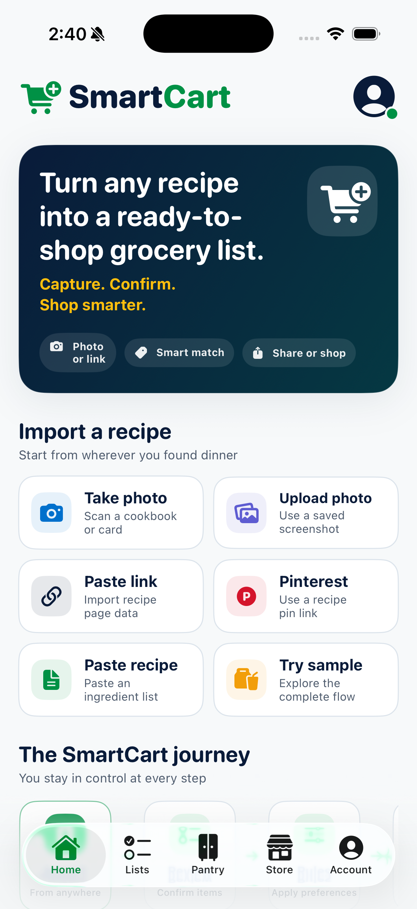

# SmartCart for iOS

SmartCart turns a recipe or reviewed Meal Prep plan into a pantry-aware, retailer-matched Shopping Trip. **Recipe Ready** brings ingredient corrections, servings, pantry decisions, retailer settings, and shopping preferences onto one adaptive confirmation screen before opening retailer-owned pages in Safari.



## Current shopping flow

Import a recipe → confirm it in Recipe Ready → start shopping → review only product exceptions → move through retailer pages in one continuous Shopping Trip → optionally update the pantry afterward.

Meal Prep combines one to five reviewed saved recipes conservatively, keeps uncertain ingredients separate until resolved, and then converges into the same Recipe Ready, matching, Shopping Trip, and pantry-update flow as a single recipe.

The app currently supports:

- Camera, photo-library, pasted-text, sample, and backend-mediated recipe-page imports.
- Multi-page Vision OCR with reading-order reconstruction, instruction boundaries, retry, and separate OCR/layout/parser confidence.
- Inline Recipe Ready editing for ingredients, servings, optional items, alternatives, and uncertain quantities, plus compact pantry and trip-settings review.
- Persistent pantry decisions, recipes, preferences, store choices, product matches, replacements, and Shopping Trip progress.
- Organic and dietary preferences filter eligible matches; budget and store-brand preferences rank them.
- Seeded exact Walmart and Target product links when an eligible record exists, and explicit unpriced retailer-search fallbacks otherwise.
- Exception-only product review: high-confidence exact matches continue without another screen; fallbacks and lower-confidence choices require an explicit accept, replacement, manual search, or skip decision.
- A continuous in-app Safari Shopping Trip. **Next Item** becomes available only after the page loads and records only that the shopper chose to advance after viewing it (`visited`); it is not evidence of any retailer, order, or purchase action.
- Durable pause and resume at the current waiting item. Tapping **Pause** or dismissing the retailer page with native close pauses without advancing. A load failure keeps the item waiting and offers retry, external open, skip, or pause.
- A post-trip pantry check-in whose purchase selections remain user-controlled. The Home reminder offers **Yes**, **Not Yet**, and **Archive**; archiving hides only that reminder and does not change the pantry, record an outcome, or remove the completed trip.
- Pantry-first review with separate package count, package size/unit, and remaining amount/unit; full/partial/possible coverage uses remaining stock, with buy-remainder math and a buy-full override.
- Persistent barcode/manual pantry inventory with checksum-valid UPC/EAN/GTIN handling, leading-zero preservation, offline fixtures, required naming for unknown products, and explicit duplicate actions.
- Privacy-limited on-device funnel instrumentation and an internal tester dashboard.
- Walmart and Target matching, with Kroger and additional retailers clearly marked Coming Soon.

The repository also includes a local reference backend in `backend/`, a local deploy-ready business website in `website/`, and explicit human validation gates in `Docs/`.

## Capability boundary

The active app path supports bounded seeded Walmart and Target catalog matching, exact public product links, clearly labeled searches, and user-driven Safari Shopping Trips. SmartCart does not expose delivery providers, pickup scheduling, multiple-store planning, account linkage, list automation, or native cart routes in this branch. Kroger is presentation-only and clearly labeled Coming Soon.

SmartCart does **not**:

- Programmatically create, modify, or inspect a retailer cart, Wishlist, Shopping List, favorites collection, order, or purchase.
- Link to a retailer account, read retailer cookies, or verify sign-in.
- Detect what the shopper did on a retailer page; **Next Item** means only “visited and advanced.”
- Reserve a pickup window, refresh live prices or inventory, or choose fulfillment.
- Transfer a basket, submit substitutions, payment, or checkout.

The selected retailer owns live location confirmation, product availability, final price, substitutions, list and cart state, fulfillment, payment, checkout, and order status.

## Persistence

State is stored as versioned JSON in Application Support. The current schema is v6. Its internal records preserve schema-v5 durable shopping trips and pantry reconciliation, the schema-v4 optional Walmart shared-Wishlist reference, and earlier shopping, pantry, and analytics state. Schema v6 adds Meal Prep scope/snapshots, the backward-compatible `visited` item status, and an optional pantry-reminder archive timestamp. Missing optional fields decode to their prior behavior. A state file written by a newer app is preserved rather than quarantined or overwritten.

## Release notes and limitations

Photo-import safety thresholds and the required human corpus are documented in [`Docs/PHOTO_PARSER_RELEASE_GATES.md`](Docs/PHOTO_PARSER_RELEASE_GATES.md). The executable 25-recipe walkthrough is in [`Docs/OCR_PARSER_HUMAN_TEST_PLAN.md`](Docs/OCR_PARSER_HUMAN_TEST_PLAN.md). The current Walmart Shopping Trip boundary and preserved legacy Wishlist details are in [`Docs/WALMART_WISHLIST_GUIDE.md`](Docs/WALMART_WISHLIST_GUIDE.md).

See [CHANGELOG.md](CHANGELOG.md) for release history and [Docs/ROADMAP_STATUS.md](Docs/ROADMAP_STATUS.md) for the engineering/human boundary.

## Build and test

Open `SmartCart.xcodeproj`, select the `SmartCart` scheme, choose an iOS 17 or newer simulator, and run.

From Terminal:

```sh
xcodebuild test \
  -project SmartCart.xcodeproj \
  -scheme SmartCart \
  -destination 'platform=iOS Simulator,name=iPhone 17'
```

The automated suite covers parsing, package conversion, preference constraints, retailer isolation, truthful fallbacks, persistence/relaunch/migration/corruption, Meal Prep, pantry state, product exceptions, Shopping Trip progress, and reconciliation. Dynamic Type and VoiceOver remain required human-validation gates; follow [Docs/CLOSED_BETA_TEST_PLAN.md](Docs/CLOSED_BETA_TEST_PLAN.md) before beta promotion.

Partner and public launch work is gated by [Docs/PARTNER_INTEGRATION_CHECKLIST.md](Docs/PARTNER_INTEGRATION_CHECKLIST.md) and [Docs/APP_STORE_RELEASE_CHECKLIST.md](Docs/APP_STORE_RELEASE_CHECKLIST.md).

## License

SmartCart is private proprietary software. See [LICENSE](LICENSE).
