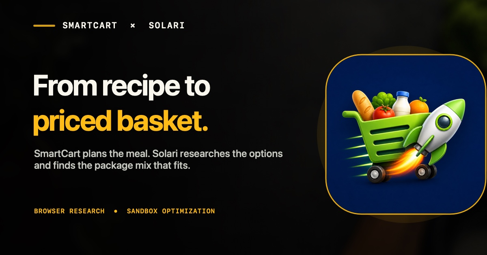

# SmartCart × Solari

**Know what you need. Compare what to buy.**

SmartCart is an iOS grocery-planning app. It turns recipes into ingredients, accounts for what is already in the pantry, and combines the shopping list.

Solari adds an optional research step: compare package options and show a basket recommendation inside SmartCart before the shopper continues to the retailer.

## See it work

**[Watch the before/after demo](https://exo-robotics.github.io/smartcart-solari/)** · [Verified result](https://exo-robotics.github.io/smartcart-solari/verified-run.html) · [Cookbook example](https://github.com/EXO-Robotics/solari-cookbook/tree/main/examples/smartcart-basket-research-ts)

- **Before:** recipe and pantry → shopping list → manual retailer search.
- **After:** the same shopping needs → researched packages → a basket recommendation → shopper-controlled handoff.

The 25-second After video is a **DEBUG recorded replay using Demo Grocer test data—not a live provider run**. The 40-second Before video shows recorded app and retailer context, not current prices or availability. The provider receipt below is separate evidence.

## One useful decision

**Spend $0.63 more to avoid buying about 1.5 lb of excess chicken.**

In the credentialed eight-item V4 run, the cheapest adequate basket cost **$23.57**. Solari selected a **$24.20** basket that still covered the trip but used a smaller chicken package, staying within the $0.75 premium limit.

The run collected **16 product observations**, executed Browser and Sandbox, and confirmed cleanup. It used our owned **Demo Grocer**, with synthetic prices—not Walmart pricing or a checkout quote.

[Immutable receipt](https://github.com/EXO-Robotics/smartcart-solari/blob/8f749e33808119ee403142929da5b757ed934e35/evidence/live/smartcart-solari-v4-qualification-33546912947.json) · [Execution workflow](https://github.com/EXO-Robotics/smartcart-solari/actions/runs/33546912947)

## What Solari does

1. **Browser observes approved product pages.** It records package identity, size, visible price, source, and observation time from rendered pages.
2. **Sandbox compares package combinations.** It evaluates cost and excess quantity across the basket using SmartCart's bounded policy.
3. **SmartCart checks and explains the result.** The native app validates evidence and arithmetic, then shows package counts, observed subtotal, coverage, and overage.
4. **The shopper decides.** Accept the research, edit the list, or continue with normal SmartCart. Unsupported items stay on the original list with a reason.

The 108-combination search could run locally. We use Sandbox for bounded remote execution; SmartCart checks the returned evidence, quantities, and cost limits rather than rerunning the optimization.

## The shopper stays in control

Research starts only when requested. Solari's research session is logged out; it does not access the shopper's Walmart account, change a cart, or perform checkout. After handoff, the shopper signs in and shops with Walmart directly. Demo Grocer products and prices are never transferred into that shopping trip, and Solari credentials stay server-side.

The current proof is **recorded native UX plus separate credentialed provider execution**. A single signed-device app → Solari → app run and authorized commercial-retailer research still need qualification.

## Run the native replay

Open `SmartCart.xcodeproj` in Xcode, run the **SmartCart** scheme in an iPhone Simulator, and choose **Open Solari Demo Meal** from Home. This uses recorded data and does not require Solari credentials.

For backend setup and provider checks, see the [backend README](backend/README.md) and [V4 qualification record](Docs/SOLARI_QUALIFICATION.md). Credentials are required only for an authorized provider run.

[Architecture](Docs/SOLARI_EXPERIMENT.md) · [Research boundaries](Docs/SOLARI_THREAT_MODEL.md) · [Contracts](contracts/v4/solari/) · [Submission packet](Docs/SOLARI_SUBMISSION_PACKET.md)

Built by **Blake Grove / [@AionForge](https://x.com/AionForge)** from the existing [SmartCart product](https://github.com/EXO-Robotics/smartcart-ios/tree/fe6589b1bd811a7ca8afa9824deba9d3cbde7ab9). This standalone repository is linked through the public [Solari Cookbook submission fork](https://github.com/EXO-Robotics/solari-cookbook); the original production checkout was left untouched.
